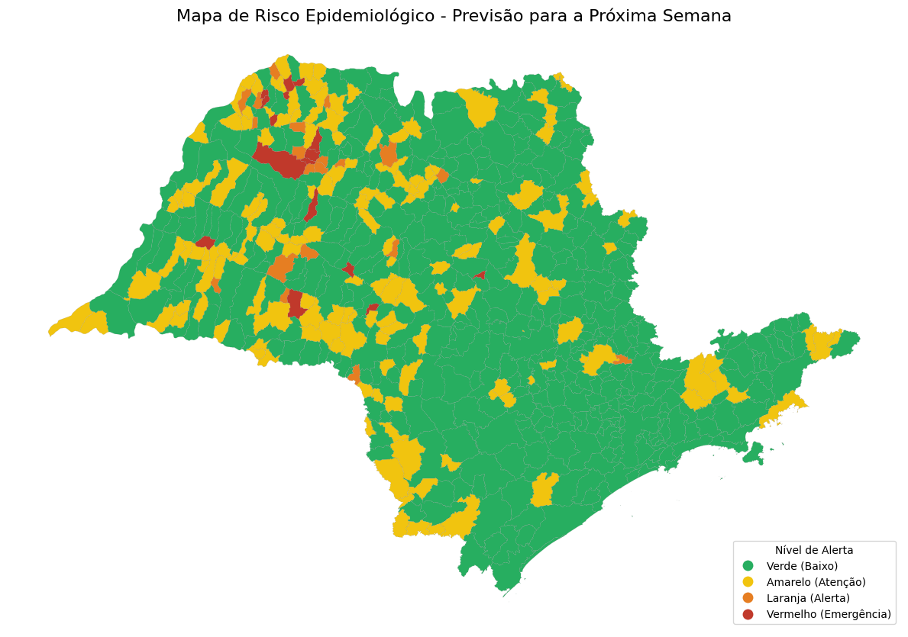
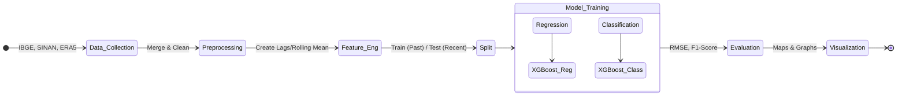
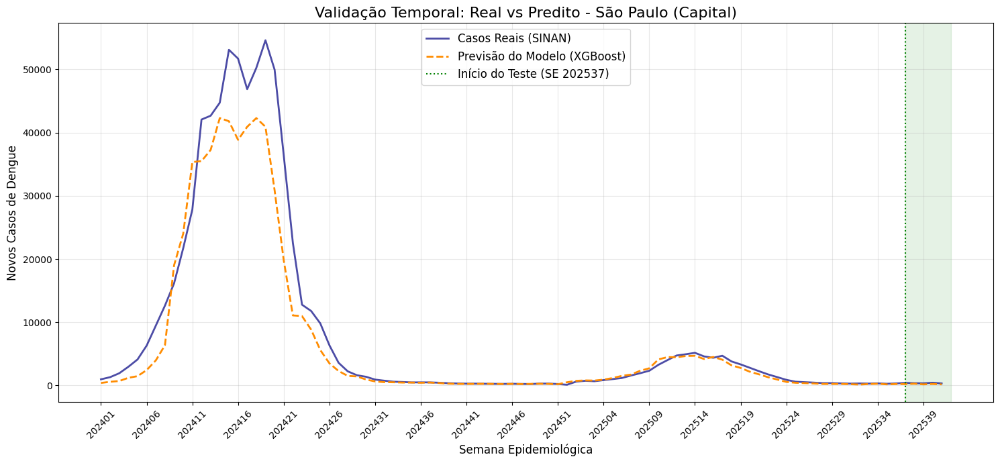
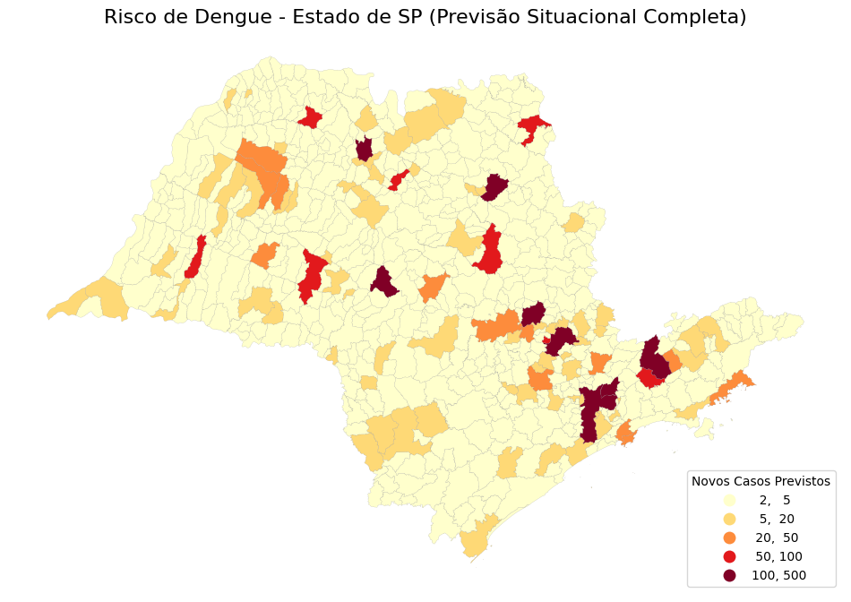
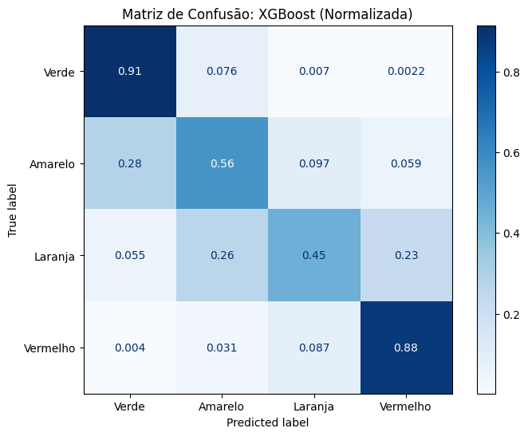

# Dengue Cases Prediction & Risk Classification in São Paulo 🦟

Project for the **Artificial Intelligence II** course: a machine learning system that predicts dengue cases and classifies epidemiological risk levels for municipalities in the State of São Paulo using climatic and historical data.

<p align="center">

</p>

<div align="center">

</div>

---

<div align="center">

• [Repository Structure](https://www.google.com/search?q=%23repository-structure-%F0%9F%93%82)
• [Overview](https://www.google.com/search?q=%23overview-%F0%9F%97%BA%EF%B8%8F)
• [Methodology](https://www.google.com/search?q=%23strategy--methodology-%F0%9F%8E%AF)
• [Libraries & Tools](https://www.google.com/search?q=%23libraries--tools-used)
• [Architecture & Algorithms](https://www.google.com/search?q=%23architecture--algorithms-%E2%9A%99%EF%B8%8F)
• [Results](https://www.google.com/search?q=%23results-%E2%9C%85)
• [How to Run](https://www.google.com/search?q=%23how-to-run-%F0%9F%9A%80)
• [Contribution](https://www.google.com/search?q=%23contribution-%F0%9F%A4%9D)
• [License](https://www.google.com/search?q=%23license-%F0%9F%93%84)
• [Members](https://www.google.com/search?q=%23members-%F0%9F%91%A5)

</div>

---

## Repository Structure 📂

```bash
dengue-prediction-sp/
├── data/                  # Raw and processed datasets (CSV, Parquet)
├── images/                # Images used in README and plots
│   ├── classification_result.png
│   ├── Confusion_matrices_classification.png
│   ├── Regressionvsreal.png
│   └── SP_prediction.png
├── notebooks/
│   └── T2deIA.ipynb       # Main Jupyter Notebook with training and evaluation
├── scripts/               # Helper scripts for data cleaning (if applicable)
├── requirements.txt       # Python dependencies
└── README.md

```

---

## Overview 🗺️

| Component | Type | Main Responsibility | Libraries / Resources Used |
| --- | --- | --- | --- |
| **`T2deIA.ipynb`** | Jupyter Notebook | Main pipeline: Data loading, preprocessing, model training (XGBoost/RF), evaluation, and visualization. | `pandas`, `scikit-learn`, `xgboost`, `matplotlib` |
| **Dataset** | CSV/Parquet | Aggregated data containing clinical (cases), demographic (population), and climatic (rain, temp) information. | **Sources:** IBGE, SINAN, ERA5, CHIRPS |
| **Regression Model** | ML Model | Predicts the exact number of dengue cases for a given epidemiological week. | `XGBRegressor`, `RandomForestRegressor` |
| **Classifier Model** | ML Model | Categorizes the risk level of a municipality (Green, Yellow, Orange, Red). | `XGBClassifier` |

---

## Libraries & Tools Used

| Category | Library / Tool | Function in Solution |
| --- | --- | --- |
| **Data Processing** | `pandas`, `numpy` | Manipulation of time-series data and feature engineering (lags, moving averages). |
| **Machine Learning** | `scikit-learn`, `xgboost` | Implementation of Regressors and Classifiers (Gradient Boosting and Random Forests). |
| **Visualization** | `matplotlib`, `seaborn` | Generation of temporal graphs, scatter plots, and confusion matrices. |
| **Geospatial** | `geopandas` | Rendering the risk map of São Paulo municipalities. |
| **Data Sources** | `SINAN`, `ERA5`, `CHIRPS` | Raw data for health notification, temperature, and precipitation respectively. |

---

## Strategy & Methodology 🎯

### High-Level Pipeline



### 1. Data Construction

We created a custom dataset merging four distinct sources. The final dataset contains over 38,000 rows with columns such as `rain_sum_mm` (weekly rainfall), `tmean_c` (average temperature), and `inc100k` (incidence per 100k inhabitants).

### 2. Regression Task

The goal is to predict the exact number of cases per week. We compared **XGBoost** and **Random Forest**.

* **Validation:** Temporal split to prevent data leakage (training on past years, testing on the most recent year).
* **Metrics:** RMSE (Root Mean Square Error) and MAE (Mean Absolute Error).

### 3. Classification Task

Municipalities were classified into 4 risk levels based on predicted case numbers:

* 🟢 **Green:** < 20 cases
* 🟡 **Yellow:** 20 - 50 cases
* 🟠 **Orange:** 50 - 100 cases
* 🔴 **Red:** > 100 cases (Emergency)

---

## Architecture & Algorithms ⚙️

### Model Selection

We utilized **Gradient Boosting (XGBoost)** as the primary engine due to its efficiency with tabular data and ability to handle non-linear relationships in climatic data.

#### Regression Analysis

The graph below shows the correlation between real values (y_true) and predicted values (y_pred). Ideally, points should align with the red dashed line.

<p align="center">

</p>

### Temporal Forecasting

The model was tested on a "future" window (the test set). The graph below demonstrates the model's ability to follow the seasonal trend of the disease in São Paulo (Capital).

<p align="center">

</p>

---

## Results ✅

### Classification Performance

The classification model achieved an accuracy of approximately **77% (F1-Score)**. Below is the **Confusion Matrix**, showing how the model performed across the four risk levels. Note the high accuracy for the "Green" and "Red" (extreme) classes.

<p align="center">

</p>

### Final Risk Map

The system generates a situational map for the State of São Paulo, coloring municipalities according to the predicted risk level for the target epidemiological week.

<p align="center">

</p>

**Summary of Metrics (XGBoost):**

* **Regression RMSE:** ~15.02 (Test)
* **Regression MAE:** ~4.15 (Test)
* **Classification Accuracy:** ~77%

---

## How to Run 🚀

To reproduce the results, follow these steps:

```bash
# 1. Clone the repository
git clone https://github.com/Vinicius-GN/Dengue-prediction-sp.git
cd Dengue-prediction-sp

# 2. Create a virtual environment (Optional but recommended)
python -m venv venv
source venv/bin/activate  # On Windows use: venv\Scripts\activate

# 3. Install dependencies
pip install pandas numpy scikit-learn xgboost matplotlib seaborn geopandas jupyter

# 4. Run the Notebook
jupyter notebook notebooks/T2deIA.ipynb

```

> **Note:** Ensure you have the dataset file located in the correct path as specified in the first cell of the notebook.

---

## Contribution 🤝

Suggestions, bug reports, and **pull requests** are welcome!

Open an **Issue** to discuss improvements or submit a **PR** directly.

---

## License 📄

This project is distributed under the MIT License. See the `LICENSE` file for more details.
